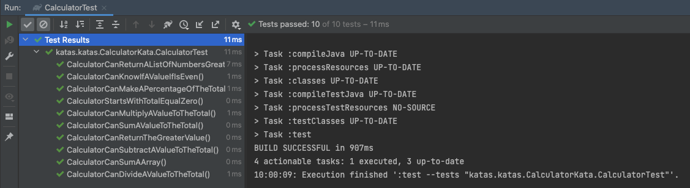

# Calculator kata 🔢

The goal of this kata is to practice with data, operators and data structures using TDD

🚥 Test → Red → Green → Refactor 🔁

## Develop 📌
```
Start a project at Spring Initializr
Or clone/fork this repo
Run the tests to see them pass!
```
## Test ✅

<p align="center">

</p>

## Rules 📋

- Make a function that adds a number with to the total of the calculator
- Make a function that subtracts a number from the calculator total
- Make a function that multiplies the total by a number
- Make a function that divides the total by a number
- Make a function that when passing a number calculates the % of the total and modifies it with the result
- Make a function that when passing a number tells us if it is even
- Make a function that when passed two numbers returns the largest
- Make a function that when passing an array of numbers puts the result of the sum of all of them in the total
- Make a function that when passing a list of integers List<int> returns another list that has only the numbers greater than or equal to 5

## Tools & Tech Stack 🧰
  
- [Spring Boot](https://spring.io/projects/spring-boot)  
- [IntelliJ Idea](https://www.jetbrains.com/idea/) or any other ID E you like
- JAVA
